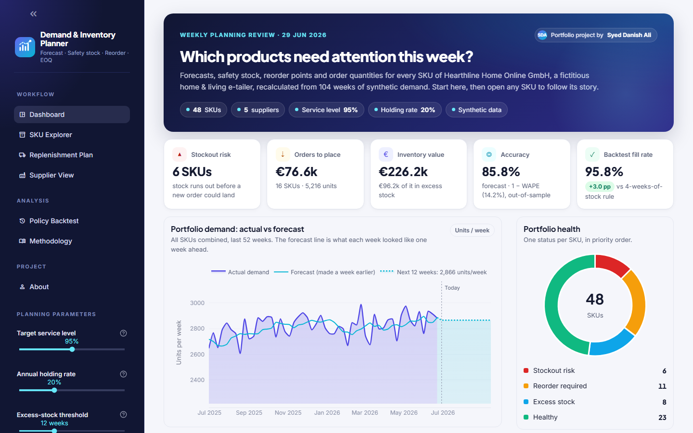
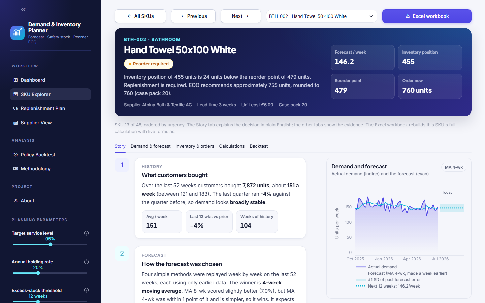
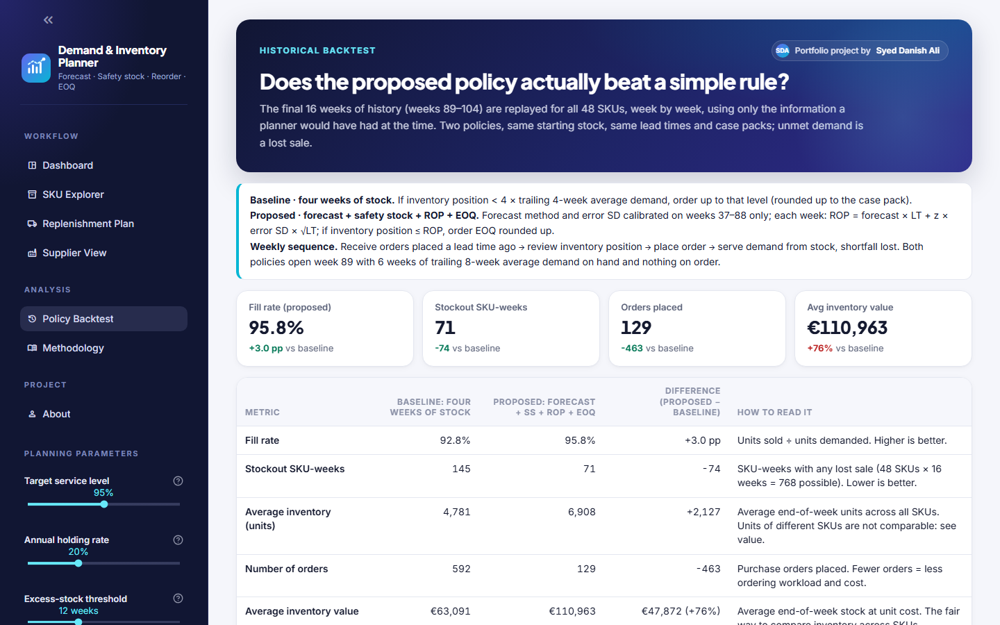

# Demand & Inventory Planner

**A weekly replenishment planning tool: which products need attention, when to reorder them, and roughly how much to order.**

Built for a fictitious home & living e-tailer with 48 SKUs, one warehouse, 5 suppliers and 104 weeks of weekly demand.
The planning logic was first prototyped and hand-checked in Excel, then implemented in Python and validated against the workbook
for every SKU. Streamlit front end, Plotly charts, no database, no API.

> **The business question.** Given what customers are expected to buy, the inventory currently available, stock already on order,
> supplier lead times and basic replenishment economics: *which products need attention, when should they be reordered, and
> approximately how much should be ordered?*



---

## What it does

1. **Forecasts** each SKU with four explainable methods (naive, 4- and 8-week moving average, simple exponential smoothing),
   scored *walk-forward* so no future information leaks into past decisions, and picks the simplest method that is within
   one WAPE point of the best.
2. **Turns forecast error into safety stock.** The standard deviation of the historical out-of-sample errors, a target
   service level and the supplier lead time give the safety stock: bigger misses → more protection.
3. **Sets the reorder point** (lead-time demand + safety stock) and compares it with the **inventory position**
   (on hand + on order − backorders), so stock already on its way never triggers a duplicate order.
4. **Sizes the order with EOQ**, rounded up to the case pack: the reorder point answers *when*, EOQ answers *how much*.
5. **Projects inventory 12 weeks ahead** with existing purchase orders and today's recommended order, flags every SKU as
   *stockout risk / reorder required / excess stock / healthy*, and explains each flag in plain English from its own numbers.
6. **Backtests the policy** by replaying the final 16 weeks against a simple "four weeks of stock" rule, week by week,
   with no look-ahead, and reports the trade-offs honestly.
7. **Groups the plan by supplier** (Supplier View): this week's purchase-order draft per supplier, where the inventory value
   and risk sit, and how the policy performs for each lead time.
8. **Exports any SKU as a live-formula Excel workbook**: forecasts, WAPE, bias, error SD, method selection, safety stock,
   reorder point, EOQ, order decision, 12-week projection and status, each as a real Excel formula, plus a sheet that checks
   every Excel result against the Python engine. Change an input in Excel and the whole chain recalculates.

## The planning chain

```
Historical sales → Forecast → WAPE / bias → Forecast error → Safety stock → Lead-time demand
→ Reorder point → Inventory position → Reorder decision → EOQ → Recommended order
→ 12-week projection → Exceptions → Historical policy comparison
```

The **SKU Explorer** lists every SKU; open one to follow its story in plain English (history → forecast → reliability →
safety stock → reorder point → EOQ → next 12 weeks → decision), with tabs for the evidence and the Excel-style calculations:



## How the numbers are computed

| Step | Formula |
|---|---|
| WAPE | Σ \|forecast − actual\| ÷ Σ actual (walk-forward, last 52 weeks) |
| Bias | Σ (forecast − actual) ÷ Σ actual (positive = over-forecasting) |
| Forecast error SD | sample standard deviation of the weekly walk-forward errors |
| Safety stock | z × error SD × √lead time, with z = NORM.S.INV(target service level) |
| Lead-time demand | weekly forecast × lead time |
| Reorder point | lead-time demand + safety stock |
| Inventory position | on hand + on order − backorders |
| EOQ | √( 2 × annual demand × ordering cost ÷ (unit cost × holding rate) ) |
| Recommended order | EOQ rounded up to the case pack if inventory position ≤ reorder point, else 0 |
| Projection | closing = opening + receipts − forecast demand, week by week |

Full definitions, assumptions and limitations: [docs/METHODOLOGY.md](docs/METHODOLOGY.md) (also the *Methodology* page in the app).

## What the backtest shows

Final 16 weeks, all 48 SKUs, unmet demand lost, parameters calibrated only on the weeks before the replay.

| Metric | Baseline: four weeks of stock | Proposed: forecast + SS + ROP + EOQ |
|---|---:|---:|
| Fill rate | 92.8% | **95.8%** |
| Stockout SKU-weeks (of 768) | 145 | **71** |
| Number of orders | 592 | **129** |
| Average inventory value | €63,091 | €110,963 |

Better service with a fifth of the orders, but 76% more inventory: a trade-off, not a free win. The picture by supplier lead
time is the interesting part. A "four weeks of stock" rule is blind to lead time: it over-protects one-week suppliers
(100% fill rate, ordering almost every week) and collapses on six-week suppliers (64% fill rate). The proposed policy sizes
protection to lead time and forecast error and lands at 94–98% for every supplier. It is slightly *worse* than the baseline on
short lead times, which the app reports as found and traces to a documented V1 simplification (safety stock covers the lead
time but not the weekly review period).



## Assumptions and limitations (the honest list)

- Fixed supplier lead times; lead-time variability is not modelled.
- Flat forecasts: no trend or seasonality (growing items are under-forecast, and the bias metric shows it).
- Weekly forecast errors assumed roughly normal and independent (square-root-of-time safety stock).
- Safety stock protects the lead time only, not lead time + review period — the first thing to change in V1.1.
- One EOQ per weekly review; no order-up-to level, minimums, discounts or capacity constraints.
- The 12-week projection includes only *today's* decision; future reviews are not simulated, and the app says so.
- One target service level for all SKUs; no ABC-XYZ segmentation.
- Backtest: one synthetic scenario, 16 weeks, lost sales. Evidence of trade-offs, not proof of general superiority.

Deliberately **not** included: ABC-XYZ, Croston/TSB, tracking signal, Forecast Value Added, lead-time variability,
multi-echelon inventory, machine-learning forecasts, solver-based optimisation. They are listed as future extensions in the app.

## Validation

The workbook in [`docs/validation/`](docs/validation/) is the methodological source of truth. The test suite extracts the
workbook's calculated results and checks the Python engine against them for **all 48 SKUs** at a tolerance of 1e-9:
forecast metrics and selection, safety stock, reorder point, inventory position, EOQ, recommended order, all 12 projection
weeks, every status, and every weekly state of the backtest for both policies (768 SKU-weeks each). Textbook examples from
the brief (EOQ ≈ 322, safety stock 99.72, ROP 390, WAPE 20%) are unit-tested separately, as are the no-look-ahead and
unit-conservation properties of the backtest.

The per-SKU Excel export is tested the same way: its formulas are recalculated without Excel (with `pycel`) and must
reproduce the engine's numbers, including after changing the service level inside the workbook.

```bash
pip install -r requirements-dev.txt
pytest          # 69 tests
```

## Run it locally

```bash
git clone https://github.com/syeddanishali17/DemandPlanningLab.git
cd DemandPlanningLab
pip install -r requirements.txt
streamlit run app.py
```

Python 3.11+. Change the target service level, holding rate or excess threshold in the sidebar and every page, including
the backtest, recalculates.

## Deploy

The app is a single Streamlit process with the CSVs in `data/`. No database or secrets.

- **Streamlit Cloud:** connect the GitHub repo, set the main file to `app.py`, Python 3.12 (`runtime.txt`).
- **Render:** Web Service, start command `streamlit run app.py --server.port $PORT --server.address 0.0.0.0`.

Install only `requirements.txt` on the host (`requirements-dev.txt` is for CI and local tests).

## Project structure

```
app.py                  Streamlit entry point: grouped sidebar navigation + planning parameters
planning/               the engine, plain Python / pandas, no Streamlit imports
  config.py             planning parameters (service level, holding rate, thresholds, z-value)
  data.py               CSV loading + validation
  forecasting.py        naive / MA / SES walk-forward, method selection
  metrics.py            WAPE, bias, error SD
  inventory.py          safety stock, ROP, inventory position, EOQ, order decision
  projection.py         12-week forward projection
  exceptions.py         statuses and plain-English reasons
  backtest.py           16-week replay of both policies
  pipeline.py           run_plan(): everything the UI needs in one call
  excel_export.py       one SKU's full calculation as a live-formula Excel workbook
ui/                     presentation only
  theme.py              palette, type scale, stylesheet
  components.py         hero, KPI tiles, badges, story timeline, tables
  charts.py             Plotly chart builders
  sku_views.py          the per-SKU story, demand, inventory, calculations and backtest views
  pages/                Dashboard · SKU Explorer · Replenishment Plan · Supplier View · Policy Backtest · Methodology · About
data/                   input CSVs (exported from the validation workbook)
tests/                  unit tests + Excel-parity tests
scripts/                export_excel_data.py, extract_excel_reference.py, screenshots.py
docs/                   METHODOLOGY.md, validation workbook, screenshots
```

All data is synthetic and generated for the scenario; no real company data is used.

Released under the [MIT License](LICENSE).

---

A portfolio project built by **Syed Danish Ali** · [LinkedIn](https://www.linkedin.com/in/syeddanishali16/)
